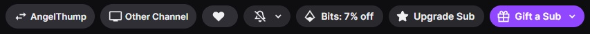

# Twitch → AngelThump Player Switcher

Tampermonkey userscript that adds two buttons to Twitch channel pages:

- **AngelThump** replaces the Twitch player with an [AngelThump](https://angelthump.com) stream.
- **Other Channel** replaces the Twitch player with another Twitch channel's player.

Only the player is replaced. The rest of the page, including chat, stays untouched.

## Install

1. Install [Tampermonkey](https://www.tampermonkey.net/) (Chrome, Firefox, Edge, Safari).
2. **[Click here to install the script](https://raw.githubusercontent.com/orgazmic/twitch-angelthump-switcher/main/twitch-angelthump-switcher.user.js)** and confirm in Tampermonkey.

## Usage

1. Open any Twitch channel page (`https://www.twitch.tv/<channel>`).
2. Click **AngelThump** or **Other Channel** in the channel header, next to Follow / Gift a Sub / Subscribe. The buttons use Twitch's native styling.
3. Enter a channel name. AngelThump is prefilled with the current channel; Other Channel also accepts a `twitch.tv/<channel>` link.
4. The replacement player loads over the Twitch player, and the active button turns purple and reads **Back to Twitch**.
5. Click **Back to Twitch** to restore the original player, or click the other button to switch source directly.

## How it works

- Injects the buttons into `[data-target="channel-header-right"]` using a `MutationObserver`, so they survive Twitch's SPA navigation.
- Overlays an iframe on top of `.video-player`: `https://player.angelthump.com/?channel=<name>` or `https://player.twitch.tv/?channel=<name>&parent=www.twitch.tv`.
- Pauses the underlying Twitch `<video>` while active, so there is no double audio, and resumes it on **Back to Twitch**.
- Removes the replacement player automatically when you navigate to another channel.

## Notes

- The embedded Twitch player runs in its own iframe. Userscripts or ad blockers that only run on the main `www.twitch.tv` page don't apply inside it, so ads can appear there.

## Troubleshooting

If Twitch changes its markup, update these selectors in the script:

| Purpose | Selector |
| --- | --- |
| Button host | `[data-target="channel-header-right"]` |
| Player container | `.video-player`, `[data-a-target="video-player"]` |

## Disclaimer

- This project is **not affiliated with, endorsed by, or sponsored by Twitch Interactive, Inc. or AngelThump**. "Twitch" and "AngelThump" and their logos are trademarks of their respective owners.
- The script only changes how the page is displayed in your own browser. It does not host, capture, rebroadcast, or redistribute any stream. The AngelThump and Twitch players are embedded from their own public player URLs.
- You are responsible for how you use it, including compliance with the Terms of Service of Twitch and AngelThump and the rights of the streamers whose content you watch.
- Provided "as is", without warranty of any kind. See [LICENSE](LICENSE).

## License

[MIT](LICENSE)